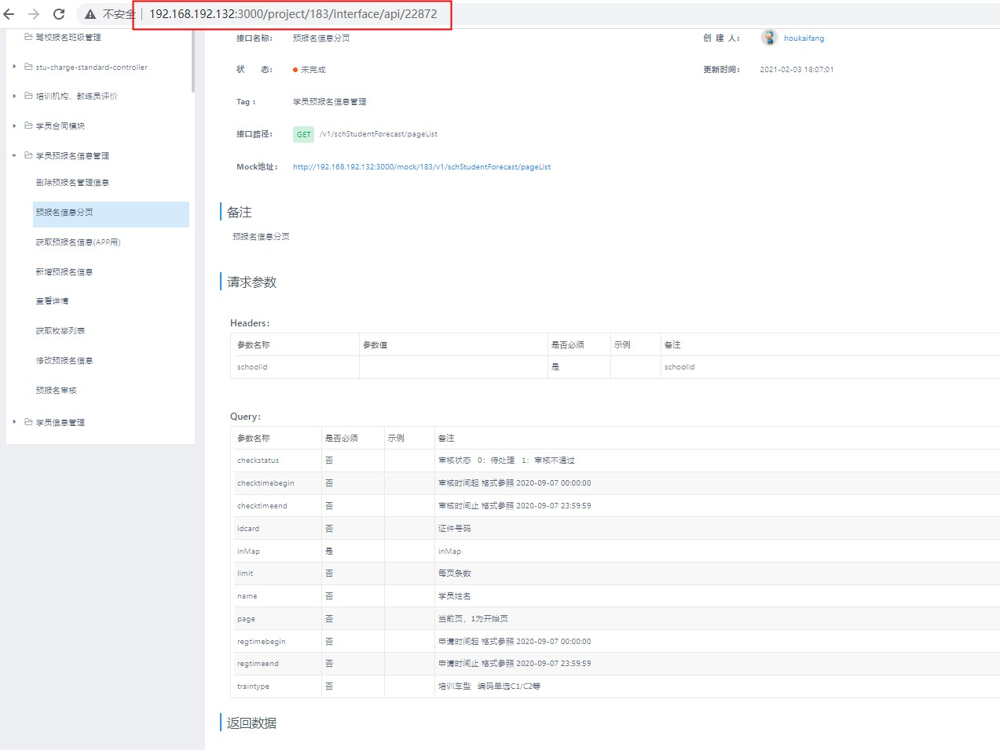
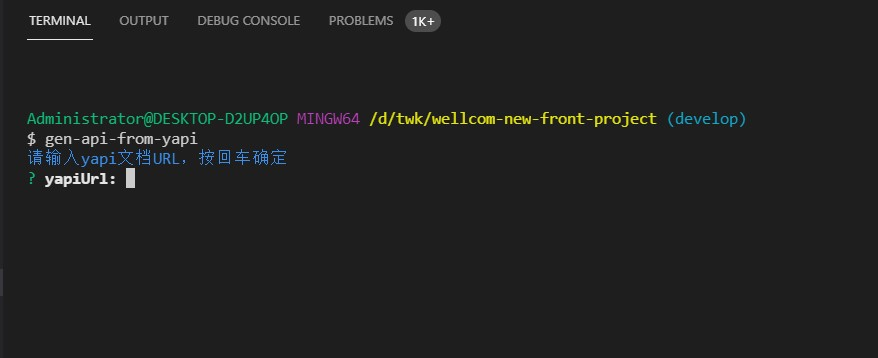
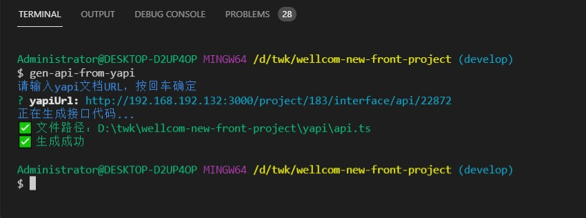
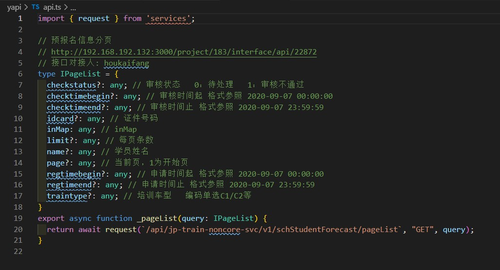

# Gen api from yapi

## Description

通过 yapi 文档地址自动生成接口函数

## How to use

### Step 1: 全局安装 `gen-api-from-yapi`

```bash
npm i -g gen-api-from-yapi
```

### Step2: 拷贝对应接口的文档地址

例如: http://192.168.192.132:3000/project/183/interface/api/22872


### Step3: 在控制台输入 `gen-api-from-yapi`



### Step4: 输入接口文档地址，等待生成



### Step5: 在对应文件路径中找到生成的文件


